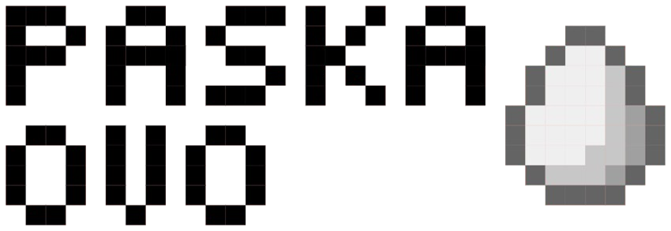

# Paska Ovo



A simple javascript library for adding easter eggs to web pages. Supports both keyboard patterns for desktop and swipe gestures for mobile devices.

[](https://jsr.io/@egamagz/paska-ovo)
[](https://jsr.io/@egamagz/paska-ovo/score)


## Installation

### For Deno

```bash
deno add jsr:@egamagz/paska-ovo
```

### For Node.js

```bash
npx jsr add @egamagz/paska-ovo
```

### For Bun

```bash
bunx jsr add @egamagz/paska-ovo
```

### For other package managers

Check the [JSR page for more details](https://jsr.io/@egamagz/paska-ovo).

## Features

- **Keyboard Easter Eggs**: Perfect for desktop users, allowing them to trigger easter eggs through keyboard sequences
- **Swipe Easter Eggs**: Designed for mobile devices, enabling users to discover easter eggs through touch gestures
- **Multiple Patterns**: Support for multiple easter eggs with similar patterns
- **Duration & Callbacks**: Configurable duration and callbacks for both onFound and onFinish events
- **Error Handling**: Graceful error handling for callback functions

## Example

```typescript
import { type EasterEgg, HistoricalCodes, PaskaOvo } from "@egamagz/paska-ovo";

const paskaOvo = new PaskaOvo()
  // Desktop: Add keyboard easter eggs
  .addKeyboardEasterEgg({
    code: HistoricalCodes.BarrelRoll,
    onFound: () => {
      // Trigger barrel roll animation
    },
    onFinish() {
      // Reset animation
    },
    duration: 1000,
    tag: "Barrel Roll",
  })
  .addKeyboardEasterEgg({
    code: ["a", "w", "e", "s", "o", "m", "e"],
    onFound: () => {
      // Show awesome message
    },
    tag: "Awesome",
  })
  // Mobile: Add swipe easter eggs
  .addSwipeEasterEgg({
    code: ["up", "right", "down"],
    onFound: () => {
      // Trigger special animation
    },
    tag: "Swipe Pattern",
  })
  .addSwipeEasterEgg({
    code: ["down", "left", "up", "right"],
    onFound: () => {
      // Show secret message
    },
    tag: "Konami Swipe",
  })
  // Global callback for all easter eggs
  .addCallback((easterEgg) => {
    alert(`You found the easter egg: ${easterEgg.tag}`);
  });

// Start listening for events
document.getElementById("add-easter-egg")?.addEventListener("click", () => {
  paskaOvo.listen();
});

// Stop listening for events
document.getElementById("remove-easter-egg")?.addEventListener("click", () => {
  paskaOvo.stop();
});
```

## Usage

### Keyboard Easter Eggs (Desktop)

Keyboard easter eggs are triggered by typing specific key sequences. They work best on desktop devices where users have access to a keyboard.

```typescript
paskaOvo.addKeyboardEasterEgg({
  code: ["a", "b", "c", "d"], // The sequence to trigger the easter egg
  onFound: () => {
    // Code to execute when the easter egg is found
  },
  onFinish: () => {
    // Optional: Code to execute after duration
  },
  duration: 1000, // Optional: Duration in milliseconds
  tag: "My Easter Egg", // Identifier for the easter egg
});
```

### Swipe Easter Eggs (Mobile)

Swipe easter eggs are triggered by performing specific swipe gestures. They are designed for mobile devices with touch screens.

```typescript
paskaOvo.addSwipeEasterEgg({
  code: ["up", "right", "down"], // The sequence of swipe directions
  onFound: () => {
    // Code to execute when the easter egg is found
  },
  onFinish: () => {
    // Optional: Code to execute after duration
  },
  duration: 1000, // Optional: Duration in milliseconds
  tag: "My Swipe Easter Egg", // Identifier for the easter egg
});
```

Check the [example](https://egamagz.github.io/paska-ovo/) with
[source code](https://github.com/EGAMAGZ/paska-ovo/tree/master/example).

## Credits

Inspired by the project [Egg.js](https://github.com/mikeflynn/egg.js) and
[La Velada Web](https://github.com/midudev/la-velada-web-oficial). Created by
[EGAMAGZ](https://github.com/EGAMAGZ).

## License

MIT License
